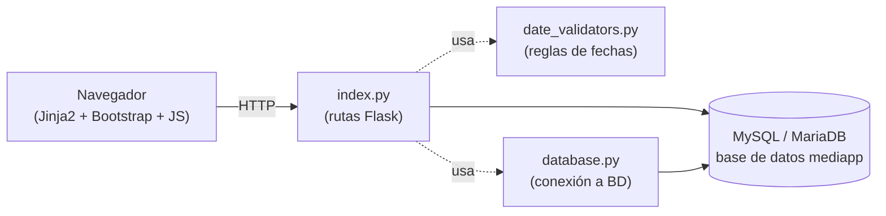
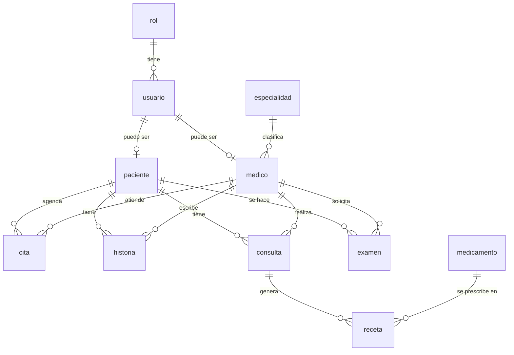

# Arquitectura de MediApp

> Guía técnica para el equipo: cómo está construido el sistema, cómo se conectan sus piezas,
> y por qué se tomó cada decisión importante. Se actualiza en cada cambio relevante — si algo
> aquí no coincide con el código, el código manda y este documento está desactualizado (repórtalo).
>
> Para instalar y arrancar el proyecto, ver [`README.md`](README.md). Este documento asume que
> ya lo tienes corriendo y explica **cómo funciona por dentro**.

---

## 1. Qué es MediApp

Sistema de agendamiento de citas clínicas con tres roles: **Administrador**, **Médico** y
**Paciente**, cada uno con su propio nivel de acceso a pacientes, citas, historias clínicas,
consultas, exámenes de laboratorio y recetas.

## 2. Stack tecnológico

| Capa | Tecnología |
|---|---|
| Backend | Python 3 + **Flask** (un solo archivo de rutas, `index.py`) |
| Base de datos | **MySQL / MariaDB** (vía XAMPP en desarrollo local) |
| Conector de BD | `mysql-connector-python` |
| Frontend | **Jinja2** (plantillas server-side) + Bootstrap 5 + JavaScript plano (sin framework) |
| Contraseñas | `werkzeug.security` (algoritmo **scrypt** — ver §7) |

No hay API REST separada ni frontend desacoplado: Flask renderiza HTML directamente. La única
excepción son dos endpoints JSON de **solo lectura**: `/api/view/...`, que alimenta el modal de
detalle reutilizado en varias pantallas, y `/api/disponibilidad/...`, para consultar horarios
libres. **No existe ningún endpoint JSON de escritura**: toda modificación pasa por las rutas
`addXX`/`editXX` que renderizan formularios (ver §6, decisión D14).

## 3. Cómo se conectan las piezas



- **`database.py`**: abre **una sola conexión global** a MySQL al arrancar la app (host, usuario,
  contraseña, base de datos `mediapp`). Todas las rutas de `index.py` la reutilizan importando
  `import database as db` y usando `db.conexion`. Antes de cada petición (`@app.before_request`),
  se hace un `ping(reconnect=True)` para reconectar solos si la conexión se cayó.
- **`date_validators.py`**: centraliza toda la lógica de fechas (zona horaria Colombia, validar
  que una fecha de nacimiento no sea futura, que una cita no sea en el pasado, etc.) para que
  "hoy" se calcule siempre igual en toda la app, sin importar la zona horaria del servidor.
- **`index.py`**: contiene **todas** las rutas, un monolito de ~2000 líneas dividido en secciones
  por módulo (usuarios, médicos, pacientes, citas, historias, exámenes, consultas, recetas,
  especialidades, medicamentos), más los dos endpoints JSON al final.

## 4. Estructura de carpetas

```
Mediapp/
├── index.py                  # Todas las rutas y la lógica de negocio
├── database.py                # Conexión a MySQL (host/usuario/password/BD)
├── date_validators.py         # Validación de fechas (zona horaria Colombia)
├── validators.py              # Otras validaciones de formulario (correo electrónico)
├── requirements.txt           # Dependencias de Python
├── Base/
│   ├── mediapp.sql            # Volcado completo: esquema + datos de ejemplo
│   └── migrations/            # Cambios al esquema, en orden (ver §8)
└── templates/                 # Plantillas Jinja2, una carpeta por módulo
    ├── base.html               # Layout general: sidebar, alertas, el modal de detalle
    ├── login.html / register.html
    ├── citas/  consultas/  especialidad/  examenes/  historias/
    ├── medicamentos/  medicos/  pacientes/  recetas/  usuarios/
    └── static/                 # CSS, JS compartido, imágenes, íconos
        ├── css/main.css        # Estilos de la app (paleta, botones, modal, combobox)
        └── js/combobox.js      # Selector con buscador (ver más abajo)
```

Cada carpeta de módulo sigue el mismo patrón de nombres: `xxMC.html` (listado / "Main Content"),
`addXX.html` (crear), `editXX.html` (editar).

### El combobox con buscador (`static/js/combobox.js`)

Los desplegables de entidades (paciente, médico, medicamento, consulta, especialidad, usuario) son
un campo único que filtra al escribir, no un `<select>` nativo. Para usarlo basta marcar el
`<select>` de siempre; el componente se aplica solo al cargar la página:

```html
<select name="id_paciente" class="form-select" required
        data-combobox data-combobox-placeholder="Escriba para buscar un paciente...">
```

Tres cosas que hay que saber si se toca esto:

- **El `<select>` sigue siendo quien envía el dato** — solo se oculta. Por eso el backend no se
  entera de nada, y un script de página que lea el `<select>` por id (como la pantalla de
  disponibilidad) sigue funcionando.
- **`required` se traslada al input visible.** Un `<select>` con `display:none` y `required` hace
  que Chrome rechace el envío con *"An invalid form control is not focusable"* y sin mensaje
  visible: el formulario se rompe en silencio.
- **El texto se pinta con `textContent`; no se construye HTML.** Los nombres son texto libre del
  usuario — es el mismo camino del XSS que se cerró en el modal (§7.5).

Los desplegables de enumeración fija (`tipo_documento`) se dejan como `<select>` nativos a
propósito: no hay nada que buscar en cinco opciones fijas.

## 5. Base de datos

11 tablas. Diagrama de relaciones:



| Tabla | Qué guarda | Nota clave |
|---|---|---|
| `rol` | Los 3 roles: `admin`, `paciente`, `medico` | — |
| `usuario` | Credenciales de acceso (username, password hasheado, rol, **estado**) | `estado` = baja lógica, ver §7.2 |
| `paciente` | Datos personales del paciente | `id_usuario` opcional (nullable) |
| `medico` | Datos del médico + su especialidad | `id_usuario` opcional — sin él, el médico no puede iniciar sesión |
| `especialidad` | Catálogo de especialidades médicas | — |
| `cita` | Citas agendadas | tiene `estado` (`agendada`/`cancelada`), ver §7.3 |
| `historia` | Historia clínica (evolución, notas) | autoría protegida, ver §6 |
| `consulta` | Diagnóstico y tratamiento de una consulta | — |
| `examen` | Exámenes de laboratorio | permisos divididos por campo, ver §6 |
| `medicamento` | Catálogo de medicamentos | — |
| `receta` | Receta ligada a una consulta | — |

**Cómo se relaciona `usuario` con las personas:** un `usuario` es solo la cuenta de acceso
(login/password/rol). La persona real vive en `paciente` o en `medico`, cada una con su propio
`id_usuario` opcional apuntando de vuelta a `usuario`. Por eso: para saber "¿de quién es esta
sesión?", el código nunca asume — siempre resuelve `id_usuario` (guardado en `session`) contra
`paciente.id_usuario` o `medico.id_usuario` según el rol.

## 6. Roles y permisos

| Módulo | Administrador | Médico | Paciente |
|---|---|---|---|
| Historia clínica | 👁️ solo lectura | ✅ crear + editar + borrar (solo las suyas) | 👁️ solo la suya |
| Consultas / diagnósticos | 👁️ solo lectura | ✅ crear + editar + borrar (solo las suyas) | 👁️ solo las suyas |
| Recetas | 👁️ solo lectura | ✅ crear + editar + borrar (solo sobre sus propias consultas) | 👁️ solo las suyas |
| Exámenes | ✅ carga el resultado | ✅ solicita (solo puede editar su propia solicitud) | 👁️ solo los suyos |
| Citas | ✅ CRUD completo | 👁️ solo ve su agenda | 👁️ ve las suyas + puede cancelarlas |
| Pacientes | ✅ CRUD completo | 👁️ solo lectura | 👁️ solo su propio perfil — ❌ no puede editarlo ni eliminarlo |
| Usuarios, médicos, especialidades, medicamentos | ✅ CRUD completo | — | — |

**Cómo se implementa en código**, tres decoradores en `index.py` (junto a `login_required`):

```python
@admin_required    # exige session['rol'] == 'admin'
@medico_required    # exige session['rol'] == 'medico'
```

Algunas rutas (`editEX`, `api_save`) no usan un decorador fijo porque **el mismo endpoint se
comparte entre dos roles con permisos distintos sobre campos distintos** — en esos casos el
chequeo de rol va al inicio de la función, no en el decorador.

### Tres patrones que se repiten en todo el código

Si vas a tocar un módulo nuevo, replica estos tres patrones — ya están resueltos y probados en
`historia`, `examen` y `cita`:

**a) El "dueño" de un registro nunca sale del formulario.**
Cuando un médico crea una historia clínica o solicita un examen, su propio `id_medico` se calcula
en el servidor a partir de la sesión (función `_current_medico_id()`), **nunca** se lee de
`request.form`. Si se leyera del formulario, cualquier médico podría manipular el POST y atribuir
un registro a otro colega.

```python
def _current_medico_id():
    """Devuelve el id_medico enlazado al usuario en sesión, o None si no es médico."""
```

**b) Autoría protegida en edición/borrado.**
Un médico solo puede editar o borrar los registros que él mismo creó. Antes de cualquier `UPDATE`
o `DELETE`, se compara `registro.id_medico == _current_medico_id()`; si no coincide, se rechaza
con un mensaje claro. El `WHERE` del `UPDATE` también incluye `id_medico=%s` como cinturón de
seguridad extra.

> `receta` no tiene columna `id_medico` propia — su dueño se resuelve haciendo `JOIN` con
> `consulta` (`receta.id_consulta → consulta.id_medico`). Cuando la tabla que estás protegiendo
> no tiene el dato de autoría directamente, súbelo por el `JOIN` correspondiente en vez de asumir
> que no aplica el patrón.

**c) Los listados filtran en tres vías.**
`hiMC`, `ciMC`, `exMC`, `coMC`, `reMC` (historias, citas, exámenes, consultas y recetas) siguen
siempre el mismo patrón: Administrador y Médico ven **todos** los registros (lectura amplia),
Paciente ve **solo los suyos** (filtrando por `paciente.id_usuario == session['id_usuario']`).

> ⚠️ Error típico a evitar: filtrar "todo lo que no sea admin" por `paciente.id_usuario` rompe la
> vista del médico, porque el `id_usuario` de un médico no tiene relación con esa columna. Este
> bug existió en `ciMC`/`exMC` y se corrigió — si agregas un listado nuevo, filtra explícitamente
> por rol (`admin` / `medico` / `paciente`), no por "es admin o no".

**d) El backend bloqueado no exime de ocultar el botón en la plantilla.**
`hiMC.html`, `coMC.html`, etc. envuelven los botones de Editar/Borrar en
`` — no basta con que la ruta tenga el decorador correcto, porque
un usuario sin permiso igual ve un botón que aparenta funcionar (el formulario se envía, la petición
sale) y solo al llegar al servidor se rechaza con un `flash`. `paMC.html` no seguía este patrón: el
botón "Delete" de cada paciente era visible y enviaba el `POST` a `deletePA` para **cualquier**
usuario logueado, incluido un paciente mirando su propia fila — `deletePA` (`@admin_required`) lo
rechazaba, pero la UI no debía mostrarlo. Corregido envolviendo "Add Patient" y los botones de
Editar/Borrar en `` (2026-09-01). Si agregas un listado nuevo,
replica este guard en la plantilla además del decorador en `index.py` — son dos capas, no una.

### El modal de detalle (`api/view`) — **solo lectura** desde 2026-09-02 (D14)

Varias pantallas tienen un ícono de ojo que abre un modal de detalle sin recargar la página (JS en
`base.html`, función `openDetail`). Ese modal llama a una sola ruta genérica:

- `GET /api/view/<módulo>/<id>` — devuelve los campos en JSON, cada uno marcado `editable: true/false`.

🔴 **`POST /api/save/<módulo>/<id>` ya no existe** (eliminado el 2026-09-02, tareas T5.5 + T5.9).
El modal **no edita nada**: pinta todos los campos como valor de lectura y, si el que mira puede
editar ese registro, ofrece abajo un botón **"Editar"** que lleva a la vista de edición de siempre
(`/editHI/<id>`, `/editPA/<id>`...), que es la que tiene las validaciones ya probadas.

Cómo se decide ese botón, y por qué así:

- El JS **no calcula permisos**: muestra "Editar" si algún campo de la respuesta viene
  `editable: true` (`Object.values(data.fields).some(f => f.editable)`) y traduce el módulo a su
  ruta con el mapa `RUTAS_EDICION` de `base.html`. Como `api/view` ya calcula `editable` con la
  misma lógica de rol y autoría que aplican las rutas `editXX`, el botón aparece **exactamente**
  cuando la vista de edición va a responder 200 — nunca lleva a un rebote por permiso denegado.
  Verificado ruta por ruta en los 3 roles: botón ⇔ 200, sin botón ⇔ 302.
- Si un módulo nuevo se agrega a `api/view`, hay que agregarlo también a `RUTAS_EDICION`. Sin
  entrada en el mapa el botón simplemente no se muestra (se falla hacia el lado seguro).

**Por qué se borró `api/save`:** era un segundo camino de escritura, paralelo a las páginas, con
su propia copia de los permisos de los 10 módulos. Los dos huecos de seguridad de estas sesiones
salieron justo de ahí y de su gemelo `api/view` (el admin conservando escritura sobre `historia`
por el modal; la fuga de datos entre pacientes). Un endpoint de escritura que ya nadie llama es el
que se olvida auditar. **Regla:** si el modal vuelve a necesitar guardar algo, no se resucita un
endpoint genérico — se hace por la ruta del módulo, que es donde viven sus validaciones.

*(Lo que sigue documenta cómo se llegó hasta aquí; `api/save` ya no existe, pero la lección sobre
mantener sincronizados los dos caminos sigue aplicando a cualquier endpoint que se agregue.)*

✅ **El frontend confía por completo en el `editable` que calcula `api/view` — nunca lo
recalcula.** Corregido el 2026-09-01: antes el JS de `base.html` hacía `const isAdmin = USER_ROLE
=== 'admin'` y solo mostraba un input si `isAdmin && f.editable`, un gate ciego que bloqueaba al
médico de editar por el modal incluso sus propias historias/consultas/recetas/exámenes (que
`api/view` ya marcaba `editable: true` correctamente para él). Se quitó ese gate: el JS ahora solo
mira `f.editable` campo por campo, y el botón "Guardar cambios" se muestra si *algún* campo de la
respuesta es editable (`Object.values(data.fields).some(f => f.editable)`), sin importar el rol.
Como contraparte, `api/view` tenía otro problema simétrico: para los módulos exclusivos del admin
(`cita`, `medico`, `paciente`, `especialidad`, `medicamento`, `usuario`) marcaba `editable: True`
**sin condición**, confiando en que el gate del frontend lo compensara — si alguna vez se quitaba
ese gate sin arreglar esto, un médico o paciente vería inputs editables (aunque `api/save` los
seguiría rechazando). Se corrigió agregando `es_admin = session.get('rol') == 'admin'` en esos seis
módulos, para que `editable` sea honesto para cualquier rol que llame a `api/view`, no solo para
admin. **Regla de aquí en adelante:** el JS nunca debe volver a decidir permisos por su cuenta —
`editable` en la respuesta de `api/view` es la única fuente de verdad, y debe calcularse con la
misma lógica de autoría/rol que ya usa `api/save` para aceptar o rechazar el guardado.

🔴🔴 **`api/view` no comprobaba dueño ni rol para decidir si devolvía el registro — solo si
podía editarlo. Corregido el 2026-09-01, era un hallazgo de seguridad real, no hipotético.**
Antes de esta fecha, `api/view` calculaba `editable` correctamente por autoría (ver arriba), pero
**nunca decidía si la petición tenía derecho a ver el registro siquiera** — el único guard era
`@login_required` en el decorador de la ruta. Como las páginas de listado (`hiMC`, `ciMC`, etc.)
sí filtran bien lo que aparece en la tabla, el hueco no era visible navegando la UI normal — pero
el endpoint en sí aceptaba cualquier ID. Confirmado en vivo: una paciente pudo leer por esta vía la
historia clínica, la cita y los datos personales completos de **otro** paciente, y enumerar
usuario+rol de cualquier cuenta, con solo cambiar el número en la URL de la petición AJAX.

**Corrección:** cada rama de `api_view` ahora comprueba explícitamente "¿puede este rol/usuario ver
este registro?" *antes* de construir la respuesta, devolviendo `jsonify({'error': ...}), 403` si
no. La regla por módulo es la misma que ya usan las listas y `api/save` (no se inventó nada nuevo):
- `historia`/`consulta`/`examen`/`receta`: admin y médico ven cualquiera; paciente solo lo suyo
  (se agregó `p.id_usuario AS paciente_id_usuario` al `SELECT` para poder comparar sin una consulta
  extra).
- `cita`: admin cualquiera; médico solo las suyas (`id_medico` propio); paciente solo las suyas.
- `paciente`: admin y médico cualquiera; paciente solo su propio perfil.
- `medico` y `usuario`: exclusivos del administrador, alineado con la matriz de `CLAUDE.md`.
- `especialidad`/`medicamento` se dejaron sin restricción de lectura a propósito: son catálogos de
  referencia, no datos de ningún paciente en particular.

También se corrigió `base.html` (`renderDetail`): antes asumía que la respuesta siempre traía
`data.fields`, así que un rechazo (403) habría roto el modal con un error de JavaScript en silencio
en vez de mostrar un mensaje. Ahora comprueba `data.fields` primero.

**Lección para el resto del proyecto:** `editable: false` no es lo mismo que "no autorizado a ver".
Cualquier endpoint que devuelva datos de un registro con dueño (paciente, médico) debe decidir
*primero* si el que pregunta tiene derecho a verlo, y solo después decidir qué tan editable es.

## 7. Seguridad

### 7.1 Contraseñas: scrypt, no bcrypt

Las contraseñas se hashean con `werkzeug.security.generate_password_hash` (algoritmo **scrypt**,
no bcrypt). Fue una decisión explícita del equipo: scrypt es un KDF con endurecimiento de memoria,
igual de válido que bcrypt según las recomendaciones de OWASP, y ya estaba integrado.

`login()` verifica **siempre** contra el hash con `check_password_hash()` — no existe (ni debe
volver a existir) ningún atajo que compare la contraseña recibida contra un valor guardado en
texto plano. Los 9 usuarios de la base de datos tienen hash `scrypt`; ninguno queda en texto
plano. Si alguna vez se inserta un usuario a mano (por ejemplo, en pruebas), su `password` debe
pasar por `generate_password_hash()` antes de guardarse — si no, simplemente no podrá iniciar
sesión, que es el comportamiento correcto.

### 7.2 Baja lógica: nunca se borra un `usuario`

Principio del proyecto: un registro de `usuario` **jamás se elimina físicamente**. "Eliminar" un
usuario significa `UPDATE usuario SET estado='inactivo'`. Consecuencias en el código:

- El login rechaza cuentas con `estado <> 'activo'`.
- Si desactivan a alguien mientras tiene la sesión abierta, se le cierra en la siguiente petición
  (chequeo en `@app.before_request`) — bloquear solo el login no basta.
- Existe una ruta `reactivateUS` para revertir la baja.

Si necesitas dar de baja algo en un módulo nuevo relacionado con `usuario`, sigue este mismo
patrón — nunca uses `DELETE FROM usuario`.

### 7.2.1 Lo mismo para `medico` — y por qué son **dos** estados, no uno

Desde la migración 005 (decisión D11-a), `medico` también tiene `estado`. "Eliminar" un médico ya
no existe en la interfaz: se **desactiva** (`deleteMED`, que hace `UPDATE`, con `reactivateMED`
para revertir). Antes esta ruta borraba la fila de verdad, y con ella la ficha de quien firmó
historias, consultas, recetas y exámenes.

⚠️ **`medico.estado` y `usuario.estado` responden preguntas distintas y no deben mezclarse:**

| | Pregunta que responde | Acción |
|---|---|---|
| `medico.estado` | ¿sigue recibiendo pacientes? | `deleteMED` / `reactivateMED` |
| `usuario.estado` | ¿puede iniciar sesión? | `toggleAccesoMED` (o el módulo de usuarios) |

Un médico de licencia queda **activo sin acceso**; uno que ya no atiende puede conservar el acceso
para consultar lo que firmó. Antes ambas cosas colgaban del mismo botón "Eliminar", que borraba la
ficha *y* desactivaba la cuenta.

🔴 **Al filtrar selectores por estado, incluye siempre el valor ya asignado.** Los desplegables de
médico solo ofrecen activos, pero `editCI` y el modal de la cita añaden explícitamente el médico
que *ya tiene* esa cita aunque esté inactivo. Sin esa excepción, editar cualquier otro campo de una
cita vieja la reasignaba a otro médico al guardar, en silencio. **Esta misma trampa se confirmó dos
veces más:** en T6.2 (migración 006, `paciente.estado`) los 14 selectores de paciente del sistema se
filtraron a activos, y los de edición (`editCI`, `editCO`, `editHI`, `editEX` y los 4 módulos de
`api_view`) llevan la misma excepción; en T6.3 (migración 007, `medicamento.estado`) los 3
selectores de medicamento (`addRE`, `editRE`, modal de `receta`) se filtraron igual, con la misma
excepción "activo o el que ya tiene asignado el registro" en los dos de edición.

A diferencia del médico, ni el paciente ni el medicamento tienen una acción de "acceso" separada que
gestionar aquí: la cuenta opcional del paciente (`paciente.id_usuario`) ya se activa/desactiva desde
el módulo de Usuarios (T6.4), y un medicamento no tiene cuenta alguna — así que `deletePA`/
`reactivatePA` y `deleteME`/`reactivateME` bastan solos, sin un `toggleAcceso*`.

⚠️ **`medicamento.estado` no reutiliza `'activo'/'inactivo'`.** Decisión D12-a: el ENUM es
`ENUM('activo','descontinuado')`. La palabra importa — describe lo que de verdad pasa (dejó de
producirse o de usarse), y evita que la interfaz sugiera que "desapareció" un medicamento que sigue
apareciendo en decenas de recetas históricas. Verificado en vivo con un medicamento con 57 recetas:
`reMC` siguió mostrando su nombre sin cambios durante todo el ciclo de baja y reactivación.

Consecuencia del borrado físico anterior: quedan dos cuentas con rol médico **sin ficha**
(`john.hernandez`, `brandon`). `medico_required` ahora detecta ese caso y muestra un aviso claro;
antes, guardar algo clínico fallaba con `Column 'id_medico' cannot be null`.

### 7.2.2 Paginación de listados (T6.10) — se aplica después del filtro de rol, nunca antes

Con datos reales (`Base/seed_demo.py`), `ciMC` pasó de 6 filas a 1343 y renderizaba **2,2 MB de
HTML de una sola vez**. `_paginar(cursor, sql, params)` (junto a `_has_user_filter`, cerca del
inicio de `index.py`) resuelve esto sin tocar el patrón de permisos de 3 vías que ya usan estos
listados: **recibe el SQL ya armado con su `WHERE` de rol** — el llamador decide primero qué filas
puede ver el admin/médico/paciente, exactamente como antes; `_paginar` solo decide cuántas de esas
filas entran en la página actual, leyendo `?page=` de la URL. Nunca decide ella misma qué es
visible — invertir ese orden (paginar y luego filtrar por rol) rompería el conteo de páginas para
cada rol.

Internamente cuenta el total envolviendo el SQL del llamador en `SELECT COUNT(*) FROM (...) AS
_conteo`, con un **cursor aparte** del que usa el llamador — así no importa si ese cursor viene con
`dictionary=True` o no, cada módulo sigue post-procesando `cursor.fetchall()` exactamente igual que
antes de T6.10. La página pedida se ajusta siempre a un rango válido: `page=0`, `page=999` o
`page=abc` no rompen nada, caen a la página 1 o a la última.

🔴 **Solo se aplicó a los 5 listados con volumen que de verdad escala con el uso** (`ciMC`, `coMC`,
`reMC`, `exMC`, `hiMC`) — no a los 10 listados del sistema. Los 5 restantes (`paMC`, `usMC`, `meMC`,
`medMC`, `esMC`) son catálogos con techo bajo (número de médicos/especialidades/medicamentos del
centro) que no reproducían el problema medido; si alguno crece lo suficiente, aplicarles el mismo
patrón es cuestión de minutos. Deliberadamente **no** se agregó un filtro por rango de fechas junto
con la paginación (aunque el hallazgo original lo sugería): eso decide qué ve el usuario por
defecto, y esa decisión de producto se dejó para T6.6/T6.9, que ya la piden explícitamente.

### 7.3 Citas: nunca se borran al cancelar

Mismo principio aplicado a `cita`: cancelar es `UPDATE cita SET estado='cancelada'`, nunca
`DELETE`. Esto preserva el historial y además libera el horario para que otra persona lo tome
(la función que valida conflictos de horario ignora las citas canceladas).

### 7.4 Inyección SQL

Todas las consultas usan parámetros (`%s` + tupla), nunca f-strings ni concatenación de strings
en el SQL. Esto ya cubre razonablemente el riesgo de inyección — mantenlo así en código nuevo.

### 7.5 XSS: el servidor escapa solo, el JS del modal no

Jinja2 escapa automáticamente todo lo que se renderiza con `{{ }}` — ningún template usa `|safe`
ni `Markup()`, así que el HTML generado por el servidor ya es seguro contra XSS por defecto. **Eso
no cubre el modal de detalle** (`base.html`, función `renderDetail`, ver §6): ese código construye
HTML a mano con `+` y lo inserta con `.innerHTML`, un camino que Jinja no protege en absoluto.

✅ **Corregido (2026-09-01):** se agregó una función `escapeHtml()` en `base.html` y se aplicó a
todo valor que venga de un campo de texto libre (`f.label`, `f.value`, `f.display`, `o.value`,
`o.label`, el mensaje de error) antes de concatenarlo en el HTML del modal. Sin esto, un valor como
`` guardado en `descripcion`, `notas`, `diagnostico`, `direccion`, o
cualquier otro campo de texto libre se habría ejecutado como HTML/JS para cualquiera que abriera el
detalle de ese registro (XSS almacenado). La sanitización se hace **al mostrar, no al guardar** —
el dato crudo se preserva en la base de datos para poder seguir editándolo.

**Regla para código nuevo:** cualquier JS que construya HTML con `+` y lo inserte con `.innerHTML`
(o `insertAdjacentHTML`, etc.) usando un valor que no sea 100% literal del código, debe pasar ese
valor por `escapeHtml()` primero. Si el HTML se genera en el servidor con `render_template()`, no
hace falta — Jinja ya lo hace.

**Mejor todavía: no construir HTML.** El combobox (§4) pinta nombres de pacientes y medicamentos
—texto libre, el mismo tipo de dato del incidente de arriba— creando los elementos con
`document.createElement` y asignando `textContent`. Así no hay nada que escapar ni que se pueda
olvidar escapar. Cuando se pueda elegir, ese es el camino preferible al de escapar una cadena.

## 8. Migraciones de base de datos

`Base/mediapp.sql` es el volcado completo (esquema + datos de ejemplo) y **ya incluye** todos los
cambios aplicados. `Base/migrations/` guarda esos cambios por separado, en orden, para quien
necesite actualizar una base de datos existente sin perder sus propios datos:

| Archivo | Qué agrega |
|---|---|
| `001_roles_citas_examenes.sql` | Rol `medico` + `medico.id_usuario` (para que el médico pueda loguearse), `cita.estado`, elimina dos índices `UNIQUE` que quedaron obsoletos al permitir cancelación y múltiples exámenes por paciente |
| `002_estado_usuario.sql` | `usuario.estado` (baja lógica) |
| `003_unique_medicamento_nombre.sql` | `UNIQUE INDEX` en `medicamento.nombre`, para bloquear duplicados en el catálogo también a nivel de base de datos |
| `004_on_delete_explicito_historia_consulta_examen.sql` | `ON DELETE/UPDATE RESTRICT` explícito en las 6 FK de `historia`/`consulta`/`examen` hacia `paciente`/`medico` — sin cambio de comportamiento, solo de intención documentada |

Si agregas una migración nueva: numérala siguiente en la secuencia, documenta el *por qué* en
comentarios SQL, y regenera `Base/mediapp.sql` con `mysqldump` al final.

## 9. Estado actual y próximos pasos

Ya implementado y probado: los 3 roles con login funcional, historia clínica y consultas
(diagnóstico/tratamiento) exclusivas del médico, recetas exclusivas del médico sobre sus propias
consultas, citas de solo lectura para el médico con separación mínima de 30 minutos entre citas
del mismo médico, exámenes con permisos divididos por campo (médico solicita / admin carga
resultado), baja lógica de usuarios, cancelación de citas por el paciente con vista de
disponibilidad de horarios, el login sin fallback de contraseña en texto plano (§7.1), y el
paciente sin forma de editar ni eliminar su propio perfil (backend ya lo bloqueaba; el botón
visible en la plantilla se corrigió el 2026-09-01, ver patrón d en §6).

También corregido (2026-09-01): un bug real en `addHI`/`addEX`/`editMED`/`addRE`/`editRE` donde un
`except` sin `return` reutilizaba un cursor ya cerrado y crasheaba la petición con un error de MySQL
no relacionado en vez de mostrar el mensaje de validación — era la causa real del fallo crítico al
agregar historial clínico reportado por el evaluador SENA (Ítem 11).

Y dashboards diferenciados por rol (2026-09-01): `menu.html` (la página `/` a la que redirige
`login()`) ahora tiene una rama propia para `medico` (antes compartía la del paciente), y se
corrigieron las "Quick Actions" del admin, que enlazaban a rutas ya exclusivas del médico
(`addHI`/`addCO`/`addRE`/`addEX`) desde D6/D7. No se agregaron URLs nuevas: el login sigue yendo a
`/` para los 3 roles, que ya cumplía "sin selección manual de rol" — lo que faltaba era que el
contenido de esa única página fuera realmente distinto por rol.

✅ **Interfaz completamente traducida al español (2026-09-01, decisión D3).** `index.py` (mensajes
`flash`, validaciones, respuestas de `api/save`) y las 35 plantillas Jinja2 (encabezados, botones,
tablas, diálogos de confirmación, títulos de pestaña, `<html lang="es">`) ya no tienen texto en
inglés — se exceptúa a propósito el texto crudo de las excepciones de MySQL (viene del driver, no
es texto de la aplicación). Ver el patrón de trabajo (script de sustitución con diccionario, en vez
de editar archivo por archivo) en `TASKS.md`, sección de notas de sesión.

✅ **El modal de edición rápida ya distingue los 3 roles (2026-09-01).** El JS de `base.html` ya no
usa el booleano `isAdmin` — confía directamente en el `editable` que calcula `api/view` por campo
(ver §6, "El modal de edición rápida"). Consecuencia real: un médico ahora puede editar sus propias
historias/consultas/recetas/exámenes también desde el modal rápido, no solo desde la página
completa. Probado con `curl`: guardado real de una historia propia vía `api/save` desde la sesión
del médico, y verificado que los 6 módulos exclusivos del admin (`cita`, `medico`, `paciente`,
`especialidad`, `medicamento`, `usuario`) siguen en solo lectura para médico y paciente, sin
regresión para el admin.

Y validaciones de robustez (2026-09-01): fecha de `consulta`/`examen` ahora se valida por formato,
no solo por presencia (§8 no aplica, sin cambios de esquema); y `medicamento.nombre` ya tiene
`UNIQUE` real en la base de datos (migración 003, §8), con el mismo mensaje de duplicado ahora
también en `editME` y en el modal AJAX — antes solo lo comprobaba `addME`.

🔴🔴 **Corregido (2026-09-01): fuga de datos entre pacientes vía `api/view`.** Ver el detalle
completo en §6, "El modal de edición rápida" — era un hallazgo de seguridad real, confirmado en
vivo, no hipotético: cualquier logueado podía leer el registro clínico o personal de cualquier
otro paciente cambiando el ID en la URL del endpoint. De paso se corrigió `paMC`, que era la única
de las 6 listas de lectura que no seguía el patrón de 3 vías ya usado en las demás (dejaba la lista
de pacientes vacía para un médico).

🛡️ **Corregido (2026-09-01): XSS almacenado en el modal de detalle** — ver §7.5. De paso se
cerraron dos huecos reales de manejo de errores: `editUS` no tenía ningún `try/except` (un
`username` duplicado la habría crasheado sin control) y `deleteME` fallaba en silencio sin mostrar
mensaje. También se agregaron mensajes claros de "ya existe" (antes mostraban el error crudo de
MySQL) a los 4 campos `UNIQUE` que no los tenían: `especialidad.nombre`, `medico.numero_identidad`,
`paciente.numero_documento` y `usuario.username`.

Y (2026-09-01) `ON DELETE`/`ON UPDATE RESTRICT` explícito en las 6 FK de `historia`/`consulta`/
`examen` hacia `paciente`/`medico` (migración 004, §8) — sin cambio de comportamiento, RESTRICT ya
era el default implícito. Ver la nota sobre por qué `mysqldump` no refleja esta diferencia en
`BASE_DE_DATOS.md` § "Restricciones de integridad (FK)".

Detalle técnico completo de todo lo anterior en `TASKS.md`/`PROGRESS.md` (no versionados en GitHub).

No quedan pendientes de software abiertos en `TASKS.md`.
