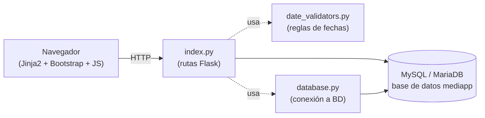
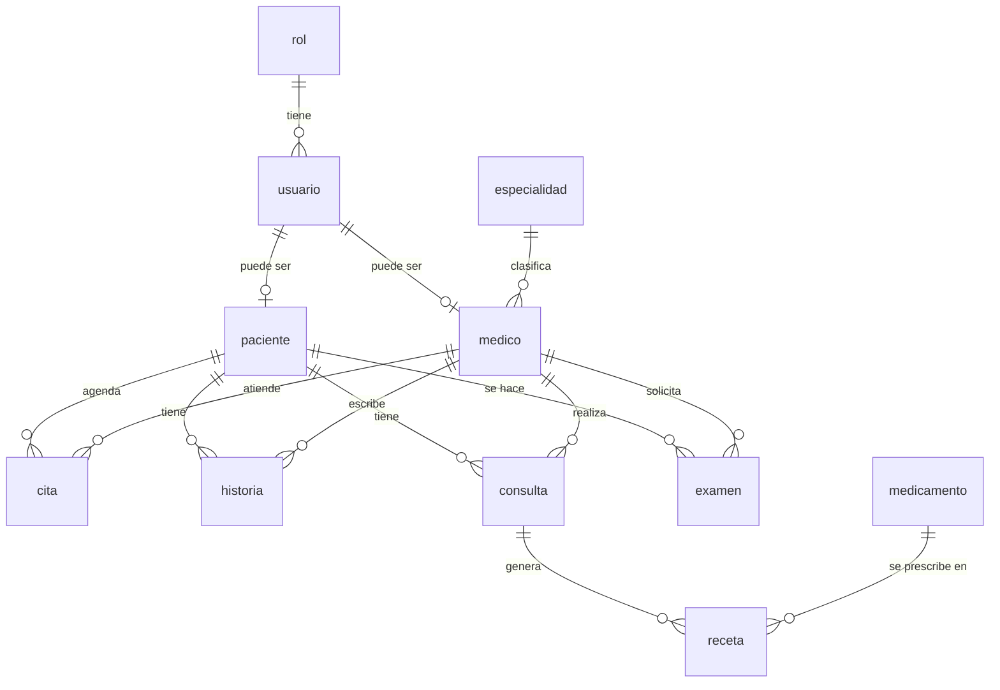

# Arquitectura de MediApp

> Guía técnica para el equipo: cómo está construido el sistema, cómo se conectan sus piezas,
> y por qué se tomó cada decisión importante. Se actualiza en cada cambio relevante — si algo
> aquí no coincide con el código, el código manda y este documento está desactualizado (repórtalo).
>
> Para instalar y arrancar el proyecto, ver [`README.md`](README.md). Este documento asume que
> ya lo tienes corriendo y explica **cómo funciona por dentro**.

---

## 1. Qué es MediApp

Sistema de agendamiento de citas clínicas con tres roles: **Administrador**, **Médico** y
**Paciente**, cada uno con su propio nivel de acceso a pacientes, citas, historias clínicas,
consultas, exámenes de laboratorio y recetas.

## 2. Stack tecnológico

| Capa | Tecnología |
|---|---|
| Backend | Python 3 + **Flask** (un solo archivo de rutas, `index.py`) |
| Base de datos | **MySQL / MariaDB** (vía XAMPP en desarrollo local) |
| Conector de BD | `mysql-connector-python` |
| Frontend | **Jinja2** (plantillas server-side) + Bootstrap 5 + JavaScript plano (sin framework) |
| Contraseñas | `werkzeug.security` (algoritmo **scrypt** — ver §7) |

No hay API REST separada ni frontend desacoplado: Flask renderiza HTML directamente. La única
excepción son dos endpoints JSON (`/api/view/...` y `/api/save/...`) que alimentan un modal de
edición rápida reutilizado en varias pantallas, y `/api/disponibilidad/...` para consultar
horarios libres.

## 3. Cómo se conectan las piezas



- **`database.py`**: abre **una sola conexión global** a MySQL al arrancar la app (host, usuario,
  contraseña, base de datos `mediapp`). Todas las rutas de `index.py` la reutilizan importando
  `import database as db` y usando `db.conexion`. Antes de cada petición (`@app.before_request`),
  se hace un `ping(reconnect=True)` para reconectar solos si la conexión se cayó.
- **`date_validators.py`**: centraliza toda la lógica de fechas (zona horaria Colombia, validar
  que una fecha de nacimiento no sea futura, que una cita no sea en el pasado, etc.) para que
  "hoy" se calcule siempre igual en toda la app, sin importar la zona horaria del servidor.
- **`index.py`**: contiene **todas** las rutas, un monolito de ~2000 líneas dividido en secciones
  por módulo (usuarios, médicos, pacientes, citas, historias, exámenes, consultas, recetas,
  especialidades, medicamentos), más los dos endpoints JSON al final.

## 4. Estructura de carpetas

```
Mediapp/
├── index.py                  # Todas las rutas y la lógica de negocio
├── database.py                # Conexión a MySQL (host/usuario/password/BD)
├── date_validators.py         # Validación de fechas (zona horaria Colombia)
├── requirements.txt           # Dependencias de Python
├── Base/
│   ├── mediapp.sql            # Volcado completo: esquema + datos de ejemplo
│   └── migrations/            # Cambios al esquema, en orden (ver §8)
└── templates/                 # Plantillas Jinja2, una carpeta por módulo
    ├── base.html               # Layout general: sidebar, alertas, el modal de edición rápida
    ├── login.html / register.html
    ├── citas/  consultas/  especialidad/  examenes/  historias/
    ├── medicamentos/  medicos/  pacientes/  recetas/  usuarios/
    └── static/                 # CSS, imágenes, íconos
```

Cada carpeta de módulo sigue el mismo patrón de nombres: `xxMC.html` (listado / "Main Content"),
`addXX.html` (crear), `editXX.html` (editar).

## 5. Base de datos

11 tablas. Diagrama de relaciones:



| Tabla | Qué guarda | Nota clave |
|---|---|---|
| `rol` | Los 3 roles: `admin`, `paciente`, `medico` | — |
| `usuario` | Credenciales de acceso (username, password hasheado, rol, **estado**) | `estado` = baja lógica, ver §7.2 |
| `paciente` | Datos personales del paciente | `id_usuario` opcional (nullable) |
| `medico` | Datos del médico + su especialidad | `id_usuario` opcional — sin él, el médico no puede iniciar sesión |
| `especialidad` | Catálogo de especialidades médicas | — |
| `cita` | Citas agendadas | tiene `estado` (`agendada`/`cancelada`), ver §7.3 |
| `historia` | Historia clínica (evolución, notas) | autoría protegida, ver §6 |
| `consulta` | Diagnóstico y tratamiento de una consulta | — |
| `examen` | Exámenes de laboratorio | permisos divididos por campo, ver §6 |
| `medicamento` | Catálogo de medicamentos | — |
| `receta` | Receta ligada a una consulta | — |

**Cómo se relaciona `usuario` con las personas:** un `usuario` es solo la cuenta de acceso
(login/password/rol). La persona real vive en `paciente` o en `medico`, cada una con su propio
`id_usuario` opcional apuntando de vuelta a `usuario`. Por eso: para saber "¿de quién es esta
sesión?", el código nunca asume — siempre resuelve `id_usuario` (guardado en `session`) contra
`paciente.id_usuario` o `medico.id_usuario` según el rol.

## 6. Roles y permisos

| Módulo | Administrador | Médico | Paciente |
|---|---|---|---|
| Historia clínica | 👁️ solo lectura | ✅ crear + editar + borrar (solo las suyas) | 👁️ solo la suya |
| Consultas / diagnósticos | 👁️ solo lectura | ✅ crear + editar + borrar (solo las suyas) | 👁️ solo las suyas |
| Recetas | 👁️ solo lectura | ✅ crear + editar + borrar (solo sobre sus propias consultas) | 👁️ solo las suyas |
| Exámenes | ✅ carga el resultado | ✅ solicita (solo puede editar su propia solicitud) | 👁️ solo los suyos |
| Citas | ✅ CRUD completo | 👁️ solo ve su agenda | 👁️ ve las suyas + puede cancelarlas |
| Pacientes | ✅ CRUD completo | 👁️ solo lectura | 👁️ solo su propio perfil — ❌ no puede editarlo ni eliminarlo |
| Usuarios, médicos, especialidades, medicamentos | ✅ CRUD completo | — | — |

**Cómo se implementa en código**, tres decoradores en `index.py` (junto a `login_required`):

```python
@admin_required    # exige session['rol'] == 'admin'
@medico_required    # exige session['rol'] == 'medico'
```

Algunas rutas (`editEX`, `api_save`) no usan un decorador fijo porque **el mismo endpoint se
comparte entre dos roles con permisos distintos sobre campos distintos** — en esos casos el
chequeo de rol va al inicio de la función, no en el decorador.

### Tres patrones que se repiten en todo el código

Si vas a tocar un módulo nuevo, replica estos tres patrones — ya están resueltos y probados en
`historia`, `examen` y `cita`:

**a) El "dueño" de un registro nunca sale del formulario.**
Cuando un médico crea una historia clínica o solicita un examen, su propio `id_medico` se calcula
en el servidor a partir de la sesión (función `_current_medico_id()`), **nunca** se lee de
`request.form`. Si se leyera del formulario, cualquier médico podría manipular el POST y atribuir
un registro a otro colega.

```python
def _current_medico_id():
    """Devuelve el id_medico enlazado al usuario en sesión, o None si no es médico."""
```

**b) Autoría protegida en edición/borrado.**
Un médico solo puede editar o borrar los registros que él mismo creó. Antes de cualquier `UPDATE`
o `DELETE`, se compara `registro.id_medico == _current_medico_id()`; si no coincide, se rechaza
con un mensaje claro. El `WHERE` del `UPDATE` también incluye `id_medico=%s` como cinturón de
seguridad extra.

> `receta` no tiene columna `id_medico` propia — su dueño se resuelve haciendo `JOIN` con
> `consulta` (`receta.id_consulta → consulta.id_medico`). Cuando la tabla que estás protegiendo
> no tiene el dato de autoría directamente, súbelo por el `JOIN` correspondiente en vez de asumir
> que no aplica el patrón.

**c) Los listados filtran en tres vías.**
`hiMC`, `ciMC`, `exMC`, `coMC`, `reMC` (historias, citas, exámenes, consultas y recetas) siguen
siempre el mismo patrón: Administrador y Médico ven **todos** los registros (lectura amplia),
Paciente ve **solo los suyos** (filtrando por `paciente.id_usuario == session['id_usuario']`).

> ⚠️ Error típico a evitar: filtrar "todo lo que no sea admin" por `paciente.id_usuario` rompe la
> vista del médico, porque el `id_usuario` de un médico no tiene relación con esa columna. Este
> bug existió en `ciMC`/`exMC` y se corrigió — si agregas un listado nuevo, filtra explícitamente
> por rol (`admin` / `medico` / `paciente`), no por "es admin o no".

**d) El backend bloqueado no exime de ocultar el botón en la plantilla.**
`hiMC.html`, `coMC.html`, etc. envuelven los botones de Editar/Borrar en
`` — no basta con que la ruta tenga el decorador correcto, porque
un usuario sin permiso igual ve un botón que aparenta funcionar (el formulario se envía, la petición
sale) y solo al llegar al servidor se rechaza con un `flash`. `paMC.html` no seguía este patrón: el
botón "Delete" de cada paciente era visible y enviaba el `POST` a `deletePA` para **cualquier**
usuario logueado, incluido un paciente mirando su propia fila — `deletePA` (`@admin_required`) lo
rechazaba, pero la UI no debía mostrarlo. Corregido envolviendo "Add Patient" y los botones de
Editar/Borrar en `` (2026-09-01). Si agregas un listado nuevo,
replica este guard en la plantilla además del decorador en `index.py` — son dos capas, no una.

### El modal de edición rápida (`api/view` + `api/save`)

Varias pantallas tienen un ícono de ojo que abre un modal de detalle/edición sin recargar la
página (JS en `base.html`, función `openDetail`). Ese modal llama a dos rutas genéricas:

- `GET /api/view/<módulo>/<id>` — devuelve los campos en JSON, cada uno marcado `editable: true/false`.
- `POST /api/save/<módulo>/<id>` — guarda los cambios.

**Importante:** estas dos rutas manejan *todos* los módulos con un único `if/elif` por módulo.
Si cambias los permisos de un módulo en su página completa (ej. `editHI`), **tienes que revisar
también estas dos rutas** — son un camino de escritura totalmente aparte y si se te olvida, un
rol bloqueado en la página completa puede seguir escribiendo por el modal. Ya nos pasó una vez
con `historia`; en `examen` se corrigió desde el principio.

✅ **El frontend confía por completo en el `editable` que calcula `api/view` — nunca lo
recalcula.** Corregido el 2026-09-01: antes el JS de `base.html` hacía `const isAdmin = USER_ROLE
=== 'admin'` y solo mostraba un input si `isAdmin && f.editable`, un gate ciego que bloqueaba al
médico de editar por el modal incluso sus propias historias/consultas/recetas/exámenes (que
`api/view` ya marcaba `editable: true` correctamente para él). Se quitó ese gate: el JS ahora solo
mira `f.editable` campo por campo, y el botón "Guardar cambios" se muestra si *algún* campo de la
respuesta es editable (`Object.values(data.fields).some(f => f.editable)`), sin importar el rol.
Como contraparte, `api/view` tenía otro problema simétrico: para los módulos exclusivos del admin
(`cita`, `medico`, `paciente`, `especialidad`, `medicamento`, `usuario`) marcaba `editable: True`
**sin condición**, confiando en que el gate del frontend lo compensara — si alguna vez se quitaba
ese gate sin arreglar esto, un médico o paciente vería inputs editables (aunque `api/save` los
seguiría rechazando). Se corrigió agregando `es_admin = session.get('rol') == 'admin'` en esos seis
módulos, para que `editable` sea honesto para cualquier rol que llame a `api/view`, no solo para
admin. **Regla de aquí en adelante:** el JS nunca debe volver a decidir permisos por su cuenta —
`editable` en la respuesta de `api/view` es la única fuente de verdad, y debe calcularse con la
misma lógica de autoría/rol que ya usa `api/save` para aceptar o rechazar el guardado.

## 7. Seguridad

### 7.1 Contraseñas: scrypt, no bcrypt

Las contraseñas se hashean con `werkzeug.security.generate_password_hash` (algoritmo **scrypt**,
no bcrypt). Fue una decisión explícita del equipo: scrypt es un KDF con endurecimiento de memoria,
igual de válido que bcrypt según las recomendaciones de OWASP, y ya estaba integrado.

`login()` verifica **siempre** contra el hash con `check_password_hash()` — no existe (ni debe
volver a existir) ningún atajo que compare la contraseña recibida contra un valor guardado en
texto plano. Los 9 usuarios de la base de datos tienen hash `scrypt`; ninguno queda en texto
plano. Si alguna vez se inserta un usuario a mano (por ejemplo, en pruebas), su `password` debe
pasar por `generate_password_hash()` antes de guardarse — si no, simplemente no podrá iniciar
sesión, que es el comportamiento correcto.

### 7.2 Baja lógica: nunca se borra un `usuario`

Principio del proyecto: un registro de `usuario` **jamás se elimina físicamente**. "Eliminar" un
usuario significa `UPDATE usuario SET estado='inactivo'`. Consecuencias en el código:

- El login rechaza cuentas con `estado <> 'activo'`.
- Si desactivan a alguien mientras tiene la sesión abierta, se le cierra en la siguiente petición
  (chequeo en `@app.before_request`) — bloquear solo el login no basta.
- Existe una ruta `reactivateUS` para revertir la baja.

Si necesitas dar de baja algo en un módulo nuevo relacionado con `usuario`, sigue este mismo
patrón — nunca uses `DELETE FROM usuario`.

### 7.3 Citas: nunca se borran al cancelar

Mismo principio aplicado a `cita`: cancelar es `UPDATE cita SET estado='cancelada'`, nunca
`DELETE`. Esto preserva el historial y además libera el horario para que otra persona lo tome
(la función que valida conflictos de horario ignora las citas canceladas).

### 7.4 Inyección SQL

Todas las consultas usan parámetros (`%s` + tupla), nunca f-strings ni concatenación de strings
en el SQL. Esto ya cubre razonablemente el riesgo de inyección — mantenlo así en código nuevo.

## 8. Migraciones de base de datos

`Base/mediapp.sql` es el volcado completo (esquema + datos de ejemplo) y **ya incluye** todos los
cambios aplicados. `Base/migrations/` guarda esos cambios por separado, en orden, para quien
necesite actualizar una base de datos existente sin perder sus propios datos:

| Archivo | Qué agrega |
|---|---|
| `001_roles_citas_examenes.sql` | Rol `medico` + `medico.id_usuario` (para que el médico pueda loguearse), `cita.estado`, elimina dos índices `UNIQUE` que quedaron obsoletos al permitir cancelación y múltiples exámenes por paciente |
| `002_estado_usuario.sql` | `usuario.estado` (baja lógica) |

Si agregas una migración nueva: numérala siguiente en la secuencia, documenta el *por qué* en
comentarios SQL, y regenera `Base/mediapp.sql` con `mysqldump` al final.

## 9. Estado actual y próximos pasos

Ya implementado y probado: los 3 roles con login funcional, historia clínica y consultas
(diagnóstico/tratamiento) exclusivas del médico, recetas exclusivas del médico sobre sus propias
consultas, citas de solo lectura para el médico con separación mínima de 30 minutos entre citas
del mismo médico, exámenes con permisos divididos por campo (médico solicita / admin carga
resultado), baja lógica de usuarios, cancelación de citas por el paciente con vista de
disponibilidad de horarios, el login sin fallback de contraseña en texto plano (§7.1), y el
paciente sin forma de editar ni eliminar su propio perfil (backend ya lo bloqueaba; el botón
visible en la plantilla se corrigió el 2026-09-01, ver patrón d en §6).

También corregido (2026-09-01): un bug real en `addHI`/`addEX`/`editMED`/`addRE`/`editRE` donde un
`except` sin `return` reutilizaba un cursor ya cerrado y crasheaba la petición con un error de MySQL
no relacionado en vez de mostrar el mensaje de validación — era la causa real del fallo crítico al
agregar historial clínico reportado por el evaluador SENA (Ítem 11).

Y dashboards diferenciados por rol (2026-09-01): `menu.html` (la página `/` a la que redirige
`login()`) ahora tiene una rama propia para `medico` (antes compartía la del paciente), y se
corrigieron las "Quick Actions" del admin, que enlazaban a rutas ya exclusivas del médico
(`addHI`/`addCO`/`addRE`/`addEX`) desde D6/D7. No se agregaron URLs nuevas: el login sigue yendo a
`/` para los 3 roles, que ya cumplía "sin selección manual de rol" — lo que faltaba era que el
contenido de esa única página fuera realmente distinto por rol.

✅ **Interfaz completamente traducida al español (2026-09-01, decisión D3).** `index.py` (mensajes
`flash`, validaciones, respuestas de `api/save`) y las 35 plantillas Jinja2 (encabezados, botones,
tablas, diálogos de confirmación, títulos de pestaña, `<html lang="es">`) ya no tienen texto en
inglés — se exceptúa a propósito el texto crudo de las excepciones de MySQL (viene del driver, no
es texto de la aplicación). Ver el patrón de trabajo (script de sustitución con diccionario, en vez
de editar archivo por archivo) en `TASKS.md`, sección de notas de sesión.

✅ **El modal de edición rápida ya distingue los 3 roles (2026-09-01).** El JS de `base.html` ya no
usa el booleano `isAdmin` — confía directamente en el `editable` que calcula `api/view` por campo
(ver §6, "El modal de edición rápida"). Consecuencia real: un médico ahora puede editar sus propias
historias/consultas/recetas/exámenes también desde el modal rápido, no solo desde la página
completa. Probado con `curl`: guardado real de una historia propia vía `api/save` desde la sesión
del médico, y verificado que los 6 módulos exclusivos del admin (`cita`, `medico`, `paciente`,
`especialidad`, `medicamento`, `usuario`) siguen en solo lectura para médico y paciente, sin
regresión para el admin.

Detalle técnico completo de todo lo anterior en `TASKS.md`/`PROGRESS.md` (no versionados en GitHub).

No quedan pendientes abiertos de FASE 3 en `TASKS.md`.
